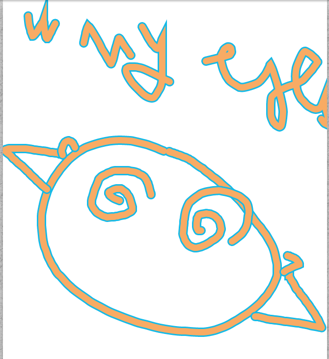

This is a repo I created just for playing with animations and implying math equations, which was quite fun.

It's not a real flutter project per say, no fancy state management or testing. 

## Available patterns

- Falling spiral, for this we use a cos and sin functions to create a circle animation but have a constant increment of 5 on the y axis to make circle "fall" slowly down the screen

- Spiral: we use a cos and sin than both are multiplied by a counter to expanding the circle constantly, the gradual incrementation of the counter make the "circle" grow slowly at each iteration, but each circle never completes because it grows again before that. Thus we obtain a spiral.

## To-Do

- [ ] Custom image picker
- [ ] Make it snow
  
## Assets attributions

- Pink flower: <a href='https://www.freepik.com/vectors/flower-collection'>Flower collection vector created by pikisuperstar - www.freepik.com</a>
- Snowflake: <a href="https://www.vecteezy.com/free-vector/snowflake">Snowflake Vectors by Vecteezy</a>
- Petals: <a href="https://www.vecteezy.com/free-vector/petals">Petals Vectors by Vecteezy</a>

